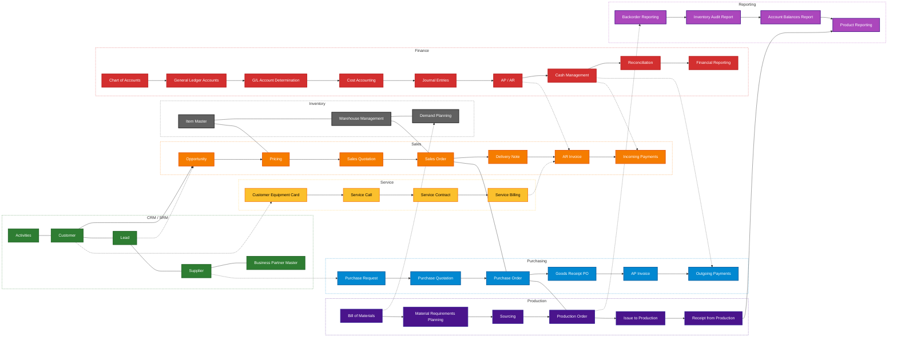

# diagramaProcesos

```mermaid
flowchart LR
    %% ==========================================
    %% Estilos de Nodos por Módulo (Colores)
    %% ==========================================
    classDef crm fill:#2E7D32,stroke:#1B5E20,stroke-width:2px,color:#fff
    classDef sales fill:#F57C00,stroke:#E65100,stroke-width:2px,color:#fff
    classDef purchasing fill:#0288D1,stroke:#01579B,stroke-width:2px,color:#fff
    classDef service fill:#FBC02D,stroke:#F57F17,stroke-width:2px,color:#000
    classDef inventory fill:#616161,stroke:#212121,stroke-width:2px,color:#fff
    classDef production fill:#4A148C,stroke:#311B92,stroke-width:2px,color:#fff
    classDef finance fill:#D32F2F,stroke:#B71C1C,stroke-width:2px,color:#fff
    classDef reporting fill:#AB47BC,stroke:#4A148C,stroke-width:2px,color:#fff

    %% Estilos sin fondo para los subgrupos (marcos sutiles)
    style CRM_SRM fill:none,stroke:#2E7D32,stroke-width:1px,stroke-dasharray: 3 3
    style SERVICE fill:none,stroke:#FBC02D,stroke-width:1px,stroke-dasharray: 3 3
    style SALES fill:none,stroke:#F57C00,stroke-width:1px,stroke-dasharray: 3 3
    style PURCHASING fill:none,stroke:#0288D1,stroke-width:1px,stroke-dasharray: 3 3
    style PRODUCTION fill:none,stroke:#4A148C,stroke-width:1px,stroke-dasharray: 3 3
    style INVENTORY fill:none,stroke:#616161,stroke-width:1px,stroke-dasharray: 3 3
    style FINANCE fill:none,stroke:#D32F2F,stroke-width:1px,stroke-dasharray: 3 3
    style REPORTING fill:none,stroke:#AB47BC,stroke-width:1px,stroke-dasharray: 3 3

    %% ==========================================
    %% Subgraph: CRM / SRM (Verde)
    %% ==========================================
    subgraph CRM_SRM ["CRM / SRM"]
        ACT["Activities"]
        CUST["Customer"]
        LEAD["Lead"]
        SUPP["Supplier"]
        BPM["Business Partner Master"]

        ACT --- CUST --- LEAD --- SUPP --- BPM
    end

    %% ==========================================
    %% Subgraph: Service (Amarillo)
    %% ==========================================
    subgraph SERVICE ["Service"]
        CEC["Customer Equipment Card"]
        SC["Service Call"]
        SCT["Service Contract"]
        SB["Service Billing"]

        CEC --> SC --> SCT --> SB
    end

    %% ==========================================
    %% Subgraph: Sales (Naranja)
    %% ==========================================
    subgraph SALES ["Sales"]
        OPP["Opportunity"]
        PRC["Pricing"]
        SQ["Sales Quotation"]
        SO["Sales Order"]
        DN["Delivery Note"]
        ARI["AR Invoice"]
        IP["Incoming Payments"]

        OPP --> PRC --> SQ --> SO --> DN --> ARI --> IP
    end

    %% ==========================================
    %% Subgraph: Purchasing (Azul)
    %% ==========================================
    subgraph PURCHASING ["Purchasing"]
        PR["Purchase Request"]
        PQ["Purchase Quotation"]
        PO["Purchase Order"]
        GRPO["Goods Receipt PO"]
        API["AP Invoice"]
        OP["Outgoing Payments"]

        PR --> PQ --> PO --> GRPO --> API --> OP
    end

    %% ==========================================
    %% Subgraph: Production (Morado)
    %% ==========================================
    subgraph PRODUCTION ["Production"]
        BOM["Bill of Materials"]
        MRP["Material Requirements Planning"]
        SRC["Sourcing"]
        PROD["Production Order"]
        ITP["Issue to Production"]
        RFP["Receipt from Production"]

        BOM --> MRP --> SRC --> PROD --> ITP --> RFP
    end

    %% ==========================================
    %% Subgraph: Inventory (Gris)
    %% ==========================================
    subgraph INVENTORY ["Inventory"]
        IM["Item Master"]
        WM["Warehouse Management"]
        DP["Demand Planning"]

        IM --- WM --- DP
    end

    %% ==========================================
    %% Subgraph: Finance (Rojo)
    %% ==========================================
    subgraph FINANCE ["Finance"]
        COA["Chart of Accounts"]
        GLA["General Ledger Accounts"]
        GLD["G/L Account Determination"]
        CA["Cost Accounting"]
        JE["Journal Entries"]
        APAR["AP / AR"]
        CM["Cash Management"]
        REC["Reconciliation"]
        FR["Financial Reporting"]

        COA --> GLA --> GLD --> CA --> JE --> APAR --> CM --> REC --> FR
    end

    %% ==========================================
    %% Subgraph: Reporting (Magenta)
    %% ==========================================
    subgraph REPORTING ["Reporting"]
        BR["Backorder Reporting"]
        IAR["Inventory Audit Report"]
        ABR["Account Balances Report"]
        PR_REP["Product Reporting"]

        BR --> IAR --> ABR --> PR_REP
    end

    %% ==========================================
    %% Interconexiones de Procesos
    %% ==========================================
    CUST --> OPP
    CUST -.-> CEC
    LEAD -.-> OPP
    SUPP -.-> PR
    IM --- PRC
    WM --- SO
    SO --- PO
    PO --- PROD
    BOM -.-> DP
    SB -.-> ARI
    PROD -.-> BR
    APAR -.-> ARI
    CM -.-> IP
    CM -.-> OP
    RFP --> PR_REP

    %% ==========================================
    %% Asignación de Colores a Nodos
    %% ==========================================
    class ACT,CUST,LEAD,SUPP,BPM crm
    class OPP,PRC,SQ,SO,DN,ARI,IP sales
    class PR,PQ,PO,GRPO,API,OP purchasing
    class CEC,SC,SCT,SB service
    class IM,WM,DP inventory
    class BOM,MRP,SRC,PROD,ITP,RFP production
    class COA,GLA,GLD,CA,JE,APAR,CM,REC,FR finance
    class BR,IAR,ABR,PR_REP reporting
```

